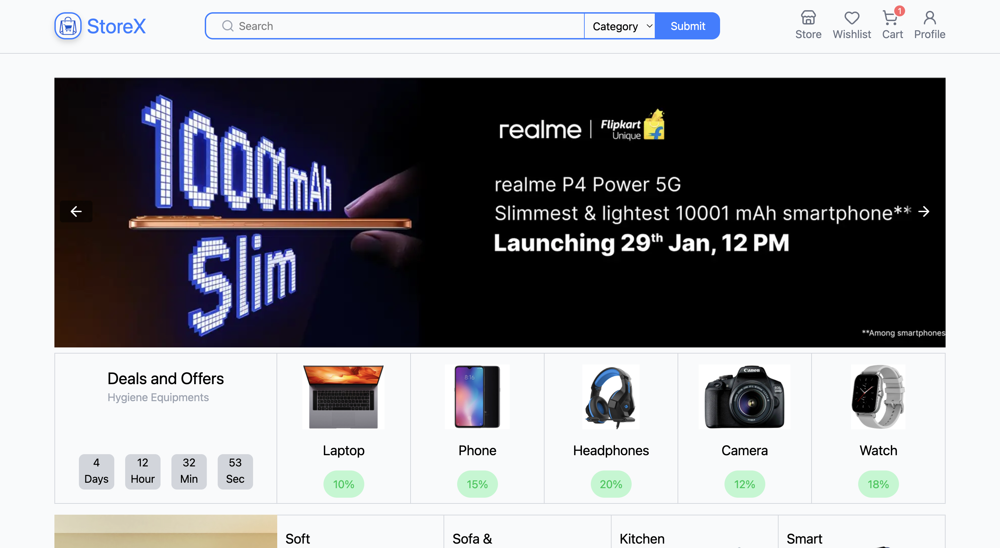
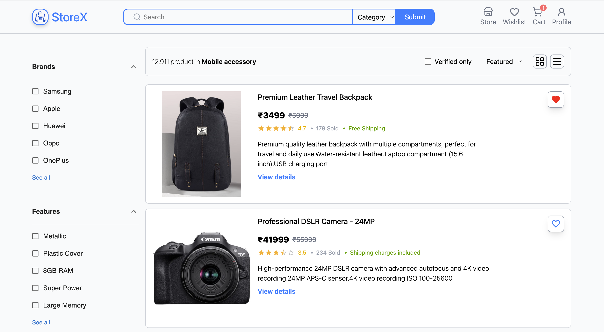

# 🛍️ StoreX - E-commerce Platform

<div align="center">


**A modern, responsive e-commerce platform built with React and Tailwind CSS**

[Live Demo](https://storexpi.vercel.app/) | [Report Bug](https://github.com/piushmaji/storex/issues) | [Request Feature](https://github.com/piushmaji/storex/issues)

[](https://reactjs.org/)
[](https://tailwindcss.com/)
[](https://vitejs.dev/)
[](LICENSE)

</div>

---

## 📋 Table of Contents

- [Overview](#-overview)
- [Screenshots](#-screenshots)
- [Features](#-features)
- [Tech Stack](#-tech-stack)
- [Project Structure](#-project-structure)
- [Getting Started](#-getting-started)
- [Components Documentation](#-components-documentation)
- [Deployment](#-deployment)
- [Troubleshooting](#-troubleshooting)
- [Contributing](#-contributing)
- [License](#-license)

---

## 🌟 Overview

StoreX is a full-featured e-commerce platform designed to provide an excellent shopping experience. Built with modern web technologies, it offers a clean, intuitive interface for browsing products, viewing deals, and connecting with suppliers.

### 🔗 Live Application
**Production URL**: [https://storexpi.vercel.app/](https://storexpi.vercel.app/)

---

## 📸 Screenshots

<div align="center">

### Desktop View

*Homepage with hero slider and featured deals*

### Mobile View


*Responsive mobile interface*

### Product Listing

*Browse products*

### Product Section

*Product Section*

### Add To Cart Section

*Add to cart section*

### Wishlist Section

*Add Your Wishlist from product listing pages*

### My Profile Section

*Edit My profile section*

</div>

---

## ✨ Features

### 🎨 User Interface
- ✅ **Fully Responsive Design** - Seamless experience on mobile, tablet, and desktop
- ✅ **Modern UI/UX** - Clean design with Tailwind CSS utilities
- ✅ **Smooth Navigation** - Intuitive menu and search functionality
- ✅ **Interactive Elements** - Hover effects and smooth transitions

### 🛒 Shopping Features
- ✅ **Product Categories** - Browse Home & Outdoor, Electronics & Gadgets
- ✅ **Deal Countdown** - Time-limited offers with live countdown timer
- ✅ **Product Recommendations** - Curated items based on categories
- ✅ **Shopping Cart** - Add items and manage cart
- ✅ **Wishlist** - Save favorite products

### 💼 Business Features
- ✅ **Quote Request System** - Send inquiries to suppliers
- ✅ **Supplier Directory** - Browse suppliers by region with flags
- ✅ **Extra Services** - Custom sourcing, shipping, and inspection
- ✅ **Image Slider** - Featured products showcase

---

## 🛠️ Tech Stack

| Technology | Version | Purpose |
|------------|---------|---------|
| **React** | 18.x | Frontend UI Library |
| **Vite** | 5.x | Build Tool & Dev Server |
| **Tailwind CSS** | 3.x | Utility-First CSS Framework |
| **Lucide React** | Latest | Icon Library |
| **JavaScript (ES6+)** | - | Programming Language |

### Additional Libraries
- `lucide-react` - Modern icon components
- React hooks (useState, useEffect) - State management

---

## 📁 Project Structure

```
storex/
│
├── public/                          # Static assets (served as-is)
│   └── img/
│       ├── mainLogo.png            # StoreX logo
│       ├── items-img/              # Product images
│       │   ├── tshirt.svg
│       │   ├── jacket.svg
│       │   ├── blezzer.svg
│       │   ├── wallet.svg
│       │   ├── bag.svg
│       │   ├── pant.svg
│       │   ├── headphone.svg
│       │   ├── pot.svg
│       │   └── cattle.svg
│       └── extraService/           # Service icons
│           ├── factory.svg
│           ├── customize.svg
│           ├── shipping.svg
│           └── inspection.svg
│
├── src/                            # Source code
│   ├── components/
│   │   ├── Navbar/
│   │   │   └── Navbar.jsx         # Navigation component
│   │   │
│   │   └── Home/
│   │       ├── Home.jsx           # Main home page component
│   │       ├── ImgSlider.jsx      # Hero image slider
│   │       ├── Deal.jsx           # Deals section with timer
│   │       ├── SendInquiry.jsx    # Quote request form
│   │       ├── RecomendedItems.jsx # Product recommendations
│   │       ├── ExtraService.jsx   # Additional services
│   │       ├── Suppliers.jsx      # Supplier directory
│   │       │
│   │       └── CategoryCards/
│   │           └── CategoryCards.jsx # Product category cards
│   │
│   ├── assets/
│   │   └── react.svg              # React logo
│   │
│   ├── App.jsx                    # Root component
│   ├── main.jsx                   # Entry point
│   └── index.css                  # Global styles (Tailwind imports)
│
├── screenshots/                   # Application screenshots
│   ├── desktop-home.png
│   ├── mobile-home.png
│   ├── categories.png
│   ├── deals.png
│   └── suppliers.png
│
├── index.html                     # HTML template
├── package.json                   # Dependencies and scripts
├── tailwind.config.js             # Tailwind configuration
├── vite.config.js                 # Vite configuration
└── README.md                      # This file
```

---

## 🚀 Getting Started

### Prerequisites

Ensure you have the following installed:
- **Node.js** (v16 or higher) - [Download](https://nodejs.org/)
- **npm** or **yarn** - Package manager

### Installation Steps

#### 1️⃣ Clone the Repository
```bash
git clone https://github.com/piushmaji/storex.git
cd storex
```

#### 2️⃣ Install Dependencies
```bash
# Using npm
npm install

# OR using yarn
yarn install
```

#### 3️⃣ Start Development Server
```bash
# Using npm
npm run dev

# OR using yarn
yarn dev
```

The application will open at `http://localhost:5173`

#### 4️⃣ Build for Production
```bash
# Using npm
npm run build

# OR using yarn
yarn build
```

Build output will be in the `dist/` folder

#### 5️⃣ Preview Production Build
```bash
# Using npm
npm run preview

# OR using yarn
yarn preview
```

### Available Scripts

| Command | Description |
|---------|-------------|
| `npm run dev` | Start development server with hot reload |
| `npm run build` | Build optimized production bundle |
| `npm run preview` | Preview production build locally |
| `npm run lint` | Run ESLint to check code quality |

---

## 📚 Components Documentation

### Navigation
- **Navbar** - Main navigation with logo, search, cart, and menu

### Home Page Sections
- **ImgSlider** - Hero carousel with featured products
- **Deal** - Time-sensitive offers with countdown
- **CategoryCards** - Product category navigation
- **RecomendedItems** - Curated product suggestions
- **ExtraService** - Additional business services
- **SendInquiry** - Quote request form
- **Suppliers** - Regional supplier directory

---

## 🚢 Deployment

### Deploy to Vercel (Recommended)

1. Push your code to GitHub
2. Visit [Vercel](https://vercel.com/)
3. Import your repository
4. Vercel will auto-detect Vite and configure build settings
5. Deploy!

### Manual Deployment

```bash
# Build the project
npm run build

# The dist/ folder contains your production-ready files
# Upload to your hosting provider
```

---

## 🐛 Troubleshooting

### Common Issues

**Issue: Images not loading**
- Check image paths in `public/img/` folder
- Ensure correct import paths in components

**Issue: Build fails**
- Clear `node_modules` and reinstall: `rm -rf node_modules && npm install`
- Clear Vite cache: `rm -rf .vite`

**Issue: Styles not applying**
- Verify Tailwind CSS is properly configured
- Check `tailwind.config.js` content paths

---

## 🤝 Contributing

Contributions are welcome! Please follow these steps:

1. Fork the repository
2. Create a feature branch (`git checkout -b feature/AmazingFeature`)
3. Commit your changes (`git commit -m 'Add some AmazingFeature'`)
4. Push to the branch (`git push origin feature/AmazingFeature`)
5. Open a Pull Request

---

## 📄 License

This project is licensed under the MIT License - see the [LICENSE](LICENSE) file for details.

---

## 🙏 Acknowledgments

- Icons by [Lucide React](https://lucide.dev/)
- Design inspiration from modern e-commerce platforms
- Built with ❤️ using React and Tailwind CSS

---

<div align="center">

**Made with ☕ by Piush Maji**

[⬆ back to top](#️-storex---e-commerce-platform)

</div>