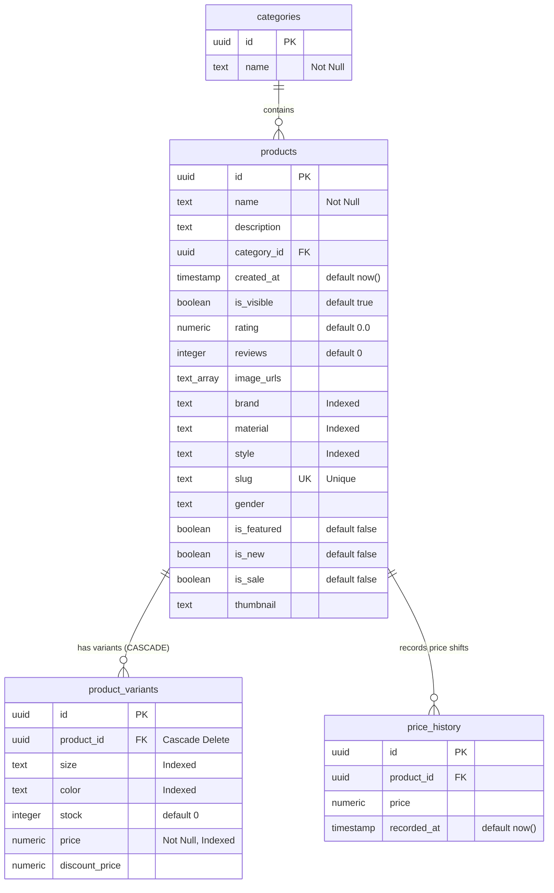

# StoreX Database Schema Analysis

This report documents and analyzes the PostgreSQL database schema for the StoreX application based on your provided DDL statements.

---

## 1. Schema Diagram (ERD)

---

## 2. Table-by-Table Technical Breakdown

### A. Categories Table (`public.categories`)
* **Primary Key:** `id` (Auto-generated UUID via `gen_random_uuid()`).
* **Attributes:** `name` (`text`, Not Null).
* **Role:** Store high-level departments or styles (e.g. *Streetwear*, *Luxury*, *Essentials*).
* **Recommendation:** Consider adding a unique constraint on `name` (`unique(name)`) to avoid duplicate categories in operations.

### B. Products Table (`public.products`)
* **Primary Key:** `id` (Auto-generated UUID).
* **Relationships:** `category_id` references `categories(id)`.
* **Unique Constraints:** `slug` is unique (`products_slug_key`). This is excellent for SEO-friendly URLs on the storefront (e.g., `storex.com/products/denim-trucker-jacket`).
* **Optimized Search Indexes:** B-tree indexes are set on:
  * `brand` (`idx_products_brand`)
  * `material` (`idx_products_material`)
  * `style` (`idx_products_style`)
  *This is optimal for faceted sidebar filters (e.g., filter by Cotton, filter by Streetwear style).*
* **Design Features:**
  * Uses a 1-dimensional array `text[]` for `image_urls`. This avoids building an additional join table to query product media assets.
  * Includes flag attributes: `is_featured`, `is_new`, `is_sale`, and `is_visible` for custom visibility queries in UI dashboards.

### C. Product Variants Table (`public.product_variants`)
* **Primary Key:** `id` (Auto-generated UUID).
* **Relationships:** `product_id` references `products(id)` with **`on delete CASCADE`**. 
  * *Critical Advantage:* If you delete a product, all options (colors, sizes) are deleted automatically, maintaining database consistency.
* **Optimized Search Indexes:** B-tree indexes are set on:
  * `price` (`idx_variants_price`)
  * `size` (`idx_variants_size`)
  * `color` (`idx_variants_color`)
  *This is vital because customers filter listings by size/color and sort by price. Indexing these ensures high performance even with millions of variants.*

### D. Price History Table (`public.price_history`)
* **Primary Key:** `id` (Auto-generated UUID).
* **Relationships:** `product_id` references `products(id)`.
* **Role:** Auditing tool to track price fluctuations over time, useful for generating dynamic backend sales metrics.

---

## 3. Potential Adjustments & Structural Considerations

> [!WARNING]
> **Missing Cascade on Price History**
> Currently, `price_history` references `products(id)` without a cascade constraint. If an admin deletes a product, the action will fail with a foreign key constraint violation because historical price records are still attached. 
> * **Fix:** Add `on delete CASCADE` to `price_history.product_id`.

> [!IMPORTANT]
> **Cascade deletion in Category**
> Currently, `products.category_id` references `categories(id)` with a standard reference. If you delete a category that contains products, the operation will fail. 
> * **Fix:** If category deletion is expected, you might want to configure `on delete SET NULL` for `category_id` inside `products`.

---

## 4. Summary of Execution Order
To deploy this SQL schema, the creation commands must be executed in this exact order:
1. **`categories`** (Has no dependencies).
2. **`products`** (Depends on `categories`).
3. **`product_variants`** (Depends on `products`).
4. **`price_history`** (Depends on `products`).
